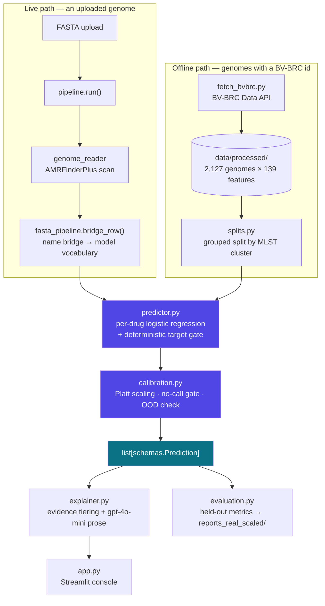

<!-- The YAML block above is Hugging Face Space metadata, used only when this repo
     is pushed to an HF Docker Space (see docs/DEPLOY_HF.md). GitHub renders it as
     a small table; it is harmless. Do not delete it. -->

<div align="center">

# 🧬 Genome Firewall

**Which antibiotic will still work on this genome — and how sure are we?**

Upload an *E. coli* whole-genome assembly. Get a calibrated, per-antibiotic
susceptibility call backed by the actual resistance genes found — including an
honest **no-call** when the evidence is not strong enough to answer.

[](https://www.python.org/)
[](#-quick-start-docker)
[](src/app.py)
[](https://github.com/ncbi/amr)
[](tests/)
[](#-license)

[**Quick start**](#-quick-start-docker) · [**How it works**](#-how-it-works) · [**Results**](#-results) · [**Limitations**](#-scope--limitations) · [**Contributing**](#-contributing)

</div>

> [!IMPORTANT]
> **This is a research prototype. All results must be confirmed with standard
> laboratory testing.** Genome Firewall is decision *support*, not a treatment
> decision, and it is strictly defensive — it explains resistance that already
> exists and will never help design or modify an organism.

---

## Why this exists

Antimicrobial resistance turns routine infections into untreatable ones, and the
lab test that tells a clinician which drug still works takes days. Sequencing is
fast — the bottleneck is *interpretation*.

Most genome-to-resistance demos get two things wrong, and both make the numbers
look better than the model is:

| Common shortcut | What Genome Firewall does instead |
|---|---|
| Random train/test split, so near-identical genomes leak across the boundary | **Grouped split by MLST sequence type** — whole lineages are held out of training |
| Forced yes/no on every drug, and a raw softmax reported as "confidence" | **Platt-calibrated probabilities** plus a real `no_call` outcome with a stated reason |
| "Feature importance" presented as biological cause | **Two separate evidence tiers** — a curated resistance gene, or a statistical association only |
| Absence of resistance markers reported as "this drug will work" | **Deterministic target gate** — a missing drug target returns `not_applicable`, never a green light |

The output is one card per antibiotic: a verdict, a calibrated confidence, an
evidence tier, the genes behind it, and a plain-language explanation.

---

## 📑 Table of contents

- [Quick start (Docker)](#-quick-start-docker)
- [Run without Docker](#run-without-docker)
- [How it works](#-how-it-works)
- [Results](#-results)
- [Usage](#-usage)
- [Configuration](#-configuration)
- [Project structure](#-project-structure)
- [Development](#-development)
- [Scope & limitations](#-scope--limitations)
- [Contributing](#-contributing)
- [License](#-license)

---

## 🚀 Quick start (Docker)

Docker is the recommended path: the image bakes in **AMRFinderPlus and its AMR
database**, and the trained model data ships in the repo — so an uploaded FASTA is
annotated and scored with zero host setup.

```bash
git clone https://github.com/omarjku/Biohackers.git
cd Biohackers

# 1. Optional: an OpenAI key for AI-written explanations.
#    Without it the app uses built-in deterministic text and still works.
cp .env.example .env          # then edit: OPENAI_API_KEY=sk-...

# 2. Build. First build is ~10–20 min (it downloads the AMR database once)
#    and produces a ~2–3 GB image. Cached after that.
docker build -t genome-firewall .

# 3. Run.
docker run --rm -p 8501:8501 --env-file .env genome-firewall
```

Open **<http://localhost:8501>**, then either upload an *E. coli* assembly
(~5 Mb FASTA) or pick a bundled example from the sidebar.

> **Start with `562.7624.fna`.** It is the one bundled genome that returns all
> three verdicts — *likely to fail*, *likely to work*, and a *no-call* — so the
> uncertainty handling is visible on screen. A live upload takes ~10–20 s
> depending on how many cores the container has.

<details>
<summary><b>Troubleshooting</b></summary>

| Symptom | Fix |
|---|---|
| Build fails on the AMRFinderPlus/conda step (Apple Silicon) | `docker build --platform=linux/amd64 -t genome-firewall .` |
| Need a public URL for a live demo | In a second terminal: `cloudflared tunnel --url http://localhost:8501` |
| `amrfinder not found on PATH` when uploading | You are running outside the container. See [Run without Docker](#run-without-docker). |

Full walkthrough and the complete troubleshooting table:
[`docs/DEMO_SETUP.md`](docs/DEMO_SETUP.md).

</details>

### Run without Docker

The model data is committed, so **bundled examples work with plain Python**.
Uploading a *new* FASTA additionally requires the `amrfinder` binary on `PATH`
(see [`docs/LIVE_DEMO.md`](docs/LIVE_DEMO.md)).

```bash
pip install -r requirements.txt
cp .env.example .env          # optional
streamlit run src/app.py
```

---

## 🧠 How it works

Two entry points share one model. The **live path** annotates an uploaded FASTA
and translates its gene names into the model's vocabulary; the **offline path**
scores genomes looked up by ID and produces the evaluation numbers.



**The three design decisions that matter:**

1. **Grouped splits, not random ones.** [`splits.py`](src/splits.py) partitions
   genomes by cluster and allocates whole clusters to train / calibration / test,
   balanced on label as well as size. No lineage appears on both sides.
2. **Calibration on a genuinely held-out third split.**
   [`calibration.py`](src/calibration.py) fits Platt scaling on rows the model
   never saw; when that split is thin it augments with out-of-fold predictions
   over grouped folds, so no genome is ever scored by a model that saw its cluster.
   A calibrated probability inside **0.30–0.70** becomes a `no_call` with a
   reason attached, as does an out-of-distribution genome.
3. **Evidence is tiered, never inferred from coefficients.** Only genes in
   [`drug_database.KNOWN_RESISTANCE_GENES`](src/drug_database.py) (25 ampicillin,
   18 ciprofloxacin, 8 trimethoprim, hand-curated) can report
   `known_gene_or_mutation`. Everything else is `statistical_association`.

The data shape passed between modules is fixed by
[`src/schemas.py`](src/schemas.py) — `Prediction` and `ExplanationResult`. Read it
before touching anything cross-module; changing a field there breaks every
consumer downstream.

---

## 📊 Results

Held-out performance on **2,127 *E. coli* genomes · 139 AMR features · 444 MLST
clusters** (BV-BRC laboratory-measured AST labels, 4,660 label rows), averaged
over **8 grouped splits**. Reproduce with the [commands below](#reproduce-the-results).

| Antibiotic | n_test | Coverage | Balanced acc. | Recall (R) | Recall (S) | AUROC | PR-AUC | Brier (raw → cal.) |
|---|---:|---:|---:|---:|---:|---:|---:|---:|
| **Ampicillin** | 375 | 95.0% | **0.939** ±0.006 | 0.913 | 0.966 | 0.948 | 0.963 | 0.069 → **0.065** |
| **Ciprofloxacin** | 384 | 84.4% | **0.853** ±0.011 | 0.760 | 0.946 | 0.908 | 0.773 | 0.116 → **0.102** |
| **Trimethoprim** | 174 | 85.1% | **0.915** ±0.019 | 0.881 | 0.948 | 0.935 | 0.904 | 0.094 → 0.096 |

*Coverage* is the share of test genomes answered; the remainder are `no_call`.

<div align="center">
  
</div>

**Read alongside the numbers, not after them:**

- **Ciprofloxacin's resistant-recall is 0.760** — the weak side, and the dangerous
  direction. Ciprofloxacin resistance is largely driven by *gyrA*/*parC* point
  mutations, which this acquired-gene feature matrix does not encode. The model
  compensates by no-calling more often (coverage 84.4%). Reported, not hidden.
- **Calibration slightly worsens Trimethoprim's Brier** (0.094 → 0.096) while
  improving the other two.
- **The leakage gap does not reproduce here.** Grouped-vs-random gaps are −0.001
  to −0.030 ([`leakage_comparison.csv`](reports_real_scaled/leakage_comparison.csv)) —
  this collection shows little clonal redundancy, so a grouped split scores about
  the same as a random one. We ran the experiment and report what it said. A
  collection built from outbreak isolates would behave very differently, which is
  exactly why the grouped split stays in.

📼 A recorded walkthrough is in the repo: [`Genome_Firewall.mp4`](Genome_Firewall.mp4).

<!-- Add assets/console.png (see assets/README.md), then uncomment:
<div align="center"></div>
-->

---

## 💻 Usage

### The console

`streamlit run src/app.py` (or the Docker image) gives you the Susceptibility
Console: upload or pick a genome, and get one card per antibiotic with the
verdict, calibrated confidence, evidence tier, supporting genes, and an
AI-written explanation. The sidebar states the supported scope and the model's
held-out metrics up front.

### Python API — score an uploaded genome

```python
import sys; sys.path.insert(0, "src")
import pipeline

qc, predictions = pipeline.analyze("data/raw/fasta_demo/562.7624.fna")
print(qc)   # {'total_bp': ..., 'n_contigs': ..., 'plausible_genome': True, 'message': ...}

for p in predictions:
    genes = ", ".join(f.gene for f in p.supporting_features) or "—"
    print(f"{p.drug:15} {p.call:16} {p.confidence:.2f}  {p.evidence_category:24} [{genes}]")
```

Every `Prediction` carries `schemas.DISCLAIMER` in its `disclaimer` field, so any
consumer — the UI, a JSON export, an evaluation dump — ships the mandatory notice.

### Python API — clinician-readable report

```python
import sys; sys.path.insert(0, "src")
import fasta_pipeline

report = fasta_pipeline.report_for_fasta(
    "data/raw/fasta_demo/562.7624.fna",
    use_llm=True,          # falls back to deterministic templates without a key
)
# -> list of dicts: drug, drug_class, underlying_state, confidence,
#    target_marker, locus_id, bio_explanation, stat_explanation
```

### CLI

```bash
# One genome, one line per antibiotic
python src/fasta_pipeline.py data/raw/fasta_demo/562.7624.fna

# Annotate a directory of FASTAs into a feature matrix (needs amrfinder on PATH).
# Caches each TSV, so an interrupted batch resumes.
python src/genome_reader.py --fasta-dir data/raw/fasta --out-dir data/processed --jobs 8

# Rebuild the dataset from the public BV-BRC Data API (no AMRFinderPlus, no Docker)
python src/fetch_bvbrc.py --out-dir data/processed
python src/fetch_bvbrc.py --limit 50          # a fast subset while iterating

# Biosecurity / ML compliance harness — exit 0 means every control holds
python verify_patch.py
```

### Reproduce the results

```python
import sys; sys.path.insert(0, "src")
from pathlib import Path
from evaluation import run_full_evaluation

run_full_evaluation(Path("data/processed"), Path("reports_real_scaled"))
```

`python src/evaluation.py` runs the same thing against the **synthetic** fixtures
and writes to `reports/` — useful for exercising the code path, never quotable as
a result about *E. coli*.

> [!WARNING]
> `fetch_bvbrc.py` and `adapt_real_data.py` both write `data/processed/`, and they
> produce **different feature vocabularies** (gene families vs. alleles). Running
> one overwrites the other's input, and their numbers are not comparable
> row-for-row. Always state which one produced a figure.
> [`docs/REPRODUCING.md`](docs/REPRODUCING.md) is the runbook.

---

## ⚙️ Configuration

| Variable | Required | Default | Effect |
|---|---|---|---|
| `OPENAI_API_KEY` | No | *unset* | Enables `gpt-4o-mini` explanations. Unset, invalid, or on any API error, the app falls back to built-in deterministic text — bounded at `timeout=8.0, max_retries=1`, so a dead key never stalls the UI. |

Copy `.env.example` to `.env`; [`app.py`](src/app.py) loads it via `python-dotenv`.
In Docker, pass it with `--env-file .env`.

Theme and server settings live in [`.streamlit/config.toml`](.streamlit/config.toml)
— the UI is pinned to the light theme deliberately, so text renders correctly for
viewers whose OS is in dark mode.

**Tuning knobs**, all documented at their definition:
`calibration.NO_CALL_LOW` / `NO_CALL_HIGH` (the ambiguous band),
`calibration.MIN_CALIBRATION_ROWS`, and `predictor.fit_drug_model(curated_count=,
aggregate_families=)`. The defaults were measured, not guessed — read the
docstrings before changing them.

---

## 📁 Project structure

```
genome-firewall/
├── src/
│   ├── schemas.py           # ⭐ the interface contract: Prediction, ExplanationResult
│   ├── data_io.py           # contract loader + validation (docs/DATA_CONTRACT.md)
│   ├── splits.py            # clustering + grouped train/calibration/test split
│   ├── predictor.py         # per-drug logistic regression, target gate, evidence tiering
│   ├── calibration.py       # Platt scaling, no-call gate, OOD envelope
│   ├── evaluation.py        # multi-seed metrics, leakage comparison, dashboard
│   ├── explainer.py         # evidence → clinician-readable prose (gpt-4o-mini)
│   ├── genome_reader.py     # FASTA → AMR feature matrix via AMRFinderPlus (CLI)
│   ├── drug_database.py     # antibiotic → target gene + curated resistance genes
│   ├── fasta_pipeline.py    # live path: FASTA → annotate → name bridge → score
│   ├── pipeline.py          # thin backend the Streamlit app calls
│   ├── fetch_bvbrc.py       # BV-BRC Data API → the four contract files (CLI)
│   ├── adapt_real_data.py   # precomputed AMRFinderPlus run → contract files
│   ├── synth_data.py        # seeded fixtures for tests and code-path demos
│   └── app.py               # Streamlit Susceptibility Console
├── data/
│   ├── processed/           # the contract files the model loads (committed)
│   ├── raw/fasta_demo/      # 4 bundled example genomes + cached annotations
│   └── synthetic/           # seeded fixtures (seed=7) — never a biological claim
├── docs/                    # DATA_CONTRACT · REPRODUCING · BVBRC_DATA · DEMO_SETUP · LIVE_DEMO · DEPLOY_HF
├── reports_real_scaled/     # ⭐ the quotable evaluation output
├── tests/                   # 129 tests
├── verify_patch.py          # biosecurity compliance harness
└── Dockerfile               # AMRFinderPlus + database baked in
```

The four contract files in `data/processed/` — `features.csv`, `labels.csv`,
`genomes.csv`, `drug_targets.json` — are specified column-by-column in
[`docs/DATA_CONTRACT.md`](docs/DATA_CONTRACT.md) and validated on load by
`data_io.validate()`.

---

## 🛠 Development

```bash
git clone https://github.com/omarjku/Biohackers.git
cd Biohackers
python -m venv .venv && source .venv/bin/activate    # Windows: .venv\Scripts\activate
pip install -r requirements.txt

pytest tests/ -q          # 129 tests, no API key or network needed
python verify_patch.py    # biosecurity controls: dedup, target gate, LLM limits, disclaimer
```

The test suite runs entirely on the synthetic fixtures and committed contract
files, so it is fast and hermetic. `verify_patch.py` *exercises* the pipeline
rather than reading it, and prints `PASS` / `FAIL` / `GAP` per control — `GAP`
means the control's logic is correct but inert because a dependency is
unpopulated, which is a real finding with a different fix.

Some tests are load-bearing rather than incidental:

- `tests/test_calibration.py::test_calibration_improves_brier_on_held_out_test`
  is the canary for the out-of-fold augmentation threshold. Do not weaken it to
  make a change pass.
- `tests/test_splits.py` pins the label-aware cluster allocator. A
  "simplification" there silently reintroduces class-imbalanced splits.

---

## 🔬 Scope & limitations

Doing one species and three antibiotics honestly beats claiming broad coverage
with forced answers.

**In scope**

- **Species:** *Escherichia coli* only.
- **Antibiotics:** Ampicillin, Ciprofloxacin, Trimethoprim.
- **Input:** a quality-checked whole-genome assembly (FASTA). Uploads below
  1 Mb are flagged by `fasta_pipeline.genome_qc()` — an empty feature vector from
  a truncated file looks identical to a genuinely susceptible genome, and would
  score as a confident, wrong "likely to work".

**Out of scope** — every other species and antibiotic; sample collection,
sequencing, and genome reconstruction; separating multiple organisms in one
sample; and **any organism design or modification**.

**Known limitations, stated plainly**

- **The feature matrix is mutation-blind.** It encodes acquired resistance genes,
  not point mutations. This is why Ciprofloxacin — driven by *gyrA*/*parC*
  substitutions — has the lowest resistant-recall and the highest no-call rate.
- **The target gate cannot fire on this matrix**, for any of the three drugs.
  AMRFinderPlus only reports an essential gene when it is *mutated*, so no bare
  `ftsI`/`gyrA`/`parC`/`folA` column exists and `predictor.target_gate()` returns
  `"unknown"` rather than `"absent"`. That is honest-by-construction — a safety
  net that is correctly wired, not a filter doing active work today.
- **`cluster_id` is MLST sequence type**, not Mash distance. MLST errs toward
  *splitting* (single-locus variants get distinct STs), so it is the less
  conservative of the two. The near-zero leakage gaps are consistent with genuinely
  low redundancy *and* with ST under-merging; that has not yet been disentangled.
- **Nothing is persisted.** `models/` is empty by design — the app fits on startup
  (~1 s at this data size, cached with `st.cache_resource`).

---

## 🤝 Contributing

Issues and pull requests are welcome. Before opening one:

1. **Read [`src/schemas.py`](src/schemas.py) first** if your change crosses a
   module boundary. It is the seam between the genome reader, the predictor, the
   explainer and the UI — changing a field there breaks every consumer silently.
   Propose it in an issue rather than shipping it.
2. **Keep the safety rules intact.** The no-call outcome, the target gate, the
   evidence tiering, the grouped split, and the disclaimer on every result are
   non-negotiable. `python verify_patch.py` must exit 0.
3. **Measure before you change a default.** Most constants in `predictor.py` and
   `calibration.py` have a measurement recorded in their docstring. Replace it
   with a new measurement, not an assertion.
4. **Run `pytest tests/ -q`** and add tests for new behaviour.
5. **Never quote a synthetic number as a real one.** `data/synthetic/` exists to
   exercise code paths; its labels come from a made-up rule. Never train on
   synthetic and real data together.

Longer-form context for contributors lives in
[`CLAUDE.md`](CLAUDE.md) — architecture decisions, what was measured, and the
open gaps with owners attached.

---

## 📄 License

Released under the **MIT License**.

## 🙏 Acknowledgements

Built for the **Hack-Nation Global AI Hackathon — Challenge 06 (OpenAI track)**,
in collaboration with the MIT Club of Northern California and the MIT Club of
Germany.

Standing on the shoulders of:
[**AMRFinderPlus**](https://github.com/ncbi/amr) (NCBI, public domain) ·
[**BV-BRC**](https://www.bv-brc.org/) (genomes and laboratory-measured AST labels) ·
[**scikit-learn**](https://scikit-learn.org/) ·
[**Streamlit**](https://streamlit.io/)

---

<div align="center">
<sub>

**Genome Firewall** — decision support, not a decision.<br>
This is a research prototype. All results must be confirmed with standard laboratory testing.

</sub>
</div>
